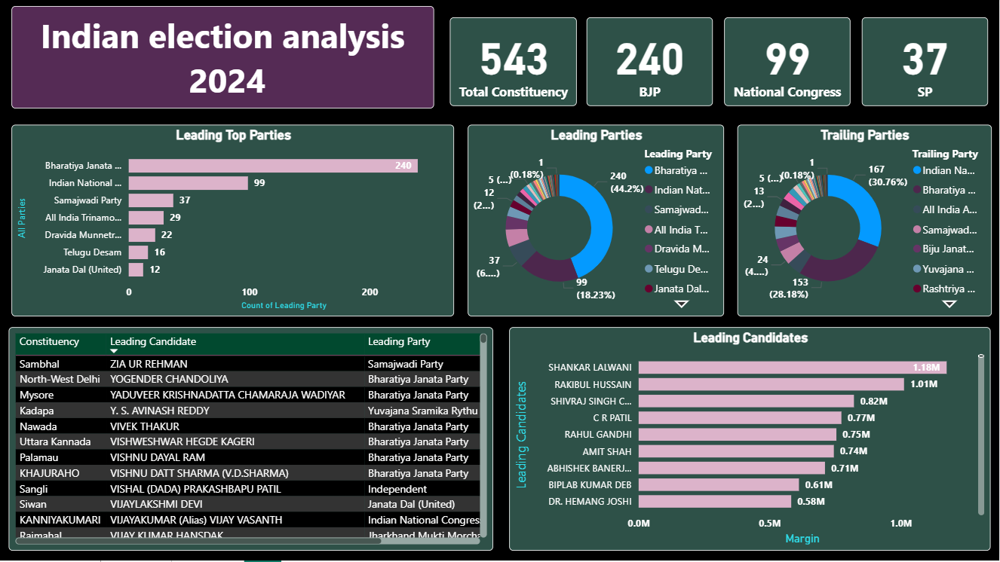
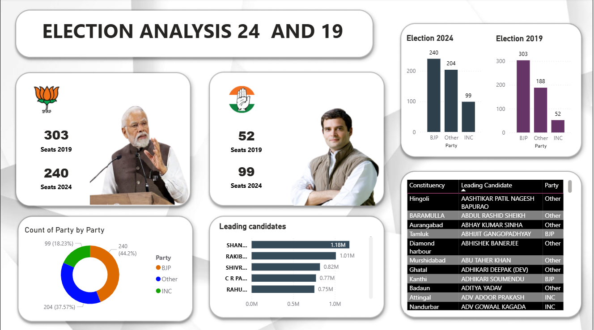

# 2024-Election Analysis

This project presents an interactive **Power BI dashboard** analyzing the results of the **Indian General Elections 2019 and 2024**.  
The dashboard compares seat distributions, leading/trailing candidates, and party-wise performance across both election years, enabling insights into political shifts and voter trends.

---

## 🚀 Project Highlights
- Comparative analysis of **Election 2019 vs Election 2024** by party and candidate performance.  
- KPIs showcasing **Total Constituencies, Party Seats, Leading & Trailing Candidates**.  
- Party-wise breakdown of results using bar charts, pie charts, and drill-through visuals.  
- Identification of **top-performing leaders** and **regional party strength**.  

---

## 📊 Dashboard Features
- **KPI Cards**: Total Constituencies, BJP Seats, INC Seats, SP Seats, etc.  
- **Party-wise Analysis**: Distribution of seats across parties (BJP, INC, SP, and others).  
- **Comparative Charts**: Bar charts comparing seat counts for 2019 & 2024.  
- **Leading Candidates Table**: Candidate names, constituencies, parties, and winning margins.  
- **Trailing Parties Visualization**: Highlights shifts in voter base and regional dynamics.  
- **Pie Charts**: Representation of seat % share for major parties.  

---

## 🛠️ Tools & Technologies
- **Power BI** – Data visualization, dashboard creation, and DAX measures.  
- **SQL Server / Excel** – Source data for election results (2019 & 2024).  
- **Power Query** – Data cleaning, transformation, and modeling.  
- **DAX (Data Analysis Expressions)** – KPIs and calculated measures.  

---

## 📂 Dataset
- `india_election_2019` – Election results for the year 2019.  
- `election_results_2024` – Election results for the year 2024.  

---

## 📈 Insights
- BJP secured **303 seats in 2019** but dropped to **240 seats in 2024**.  
- INC improved from **52 seats in 2019** to **99 seats in 2024**.  
- Regional parties like SP, DMK, and TDP showed significant presence in 2024.  
- Leading candidates include **Narendra Modi, Rahul Gandhi, Shankar Lalwani, Rakibul Hussain**, etc.  

---

## 📸 Dashboard Preview
### Election Analysis (2019 vs 2024)

### Election Analysis 2024

---

## 📌 How to Use
1. Clone this repository.  
2. Open the `.pbix` file in Power BI Desktop.  
3. Connect to datasets (`2019` and `2024` election data).  
4. Explore the interactive dashboard with slicers and filters.  

